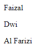
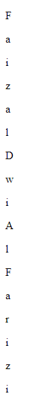

# For Of

---

## For Of

- Jika **For In** digunakan untuk melakukan iterasi **property atau index**, berbeda dengan **For Of**, ini digunakan untuk melakukan iterasi terhadap **isi value** dari iterable object, seperti Array, String dan lain-lain
- For of **tidak bisa** digunakan untuk melakukan iterasi **data di object**, karena object **bukanlah iterable**

---

## Kode : For Of di Array

```js
const names = ["Faizal", "Dwi", "Al Farizi"];

for (const name of names) {
    document.writeln(`<p>${name}</p>`)
}
```

**Hasil :**



---

## Kode : For Of di String

```js
const name = "Faizal Dwi Al Farizi";

for (const char of name) {
    document.writeln(`<p>${char}</p>`)
}
```

**Hasil :**



