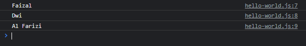

# With Statement

---

## With Statement

- **With statement** merupakan fitur yang digunakan untuk menurunkan sebuah **scope data**
- Dengan menggunakan with statement, kita bisa mengakses property dalam sebuah data **tanpa harus menyebut datanya**

---

## Kode : Tanpa With Statement

```js
const person = {
    firstName: "Faizal",
    middleName: "Dwi",
    lastName: "Al Farizi"
}

console.log(person.firstName);
console.log(person.middleName);
console.log(person.lastName);
```

**Hasil :**



---

## Kode : Dengan With Statement

```js
const person = {
    firstName: "Faizal",
    middleName: "Dwi",
    lastName: "Al Farizi"
}

with (person) {
    console.log(firstName);
    console.log(middleName);
    console.log(lastName);
}
```

**Hasil :**


---

## With Statement Tidak Direkomendasikan

- **Walaupun** fitur with statement ini sangat menarik
- Namun kebanyakan orang **tidak merekomendasikan** penggunaan with statement
- Hal ini dikarenakan with statement kadang membuat sebuah kode menjadi **ambigu**

---

## Kode : Ambigu di With Statement

```js
const person = {
    firstName: "Faizal",
    middleName: "Dwi",
    lastName: "Al Farizi"
}

const firstName = "Black";
const lastName = "Syiber";

with (person) {
    console.log(firstName); // Niatnya ingin Black
    console.log(middleName);
    console.log(lastName); // Niatnya ingin Syiber
}
```

**Hasil :**

