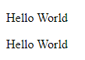

# Function

---

## Function

- **Function** adalah blok kode program yang akan berjalan saat kita panggil
- Sebelumnya kita sudah menggunakan function **writeln()** untuk menampilkan tulisan di html
- Untuk **membuat function**, kita bisa menggunakan **kata kunci function**, lalu diikuti dengan **nama function**, **kurung ()** dan diakhiri dengan block **kurung {}**
- Kita bisa **memanggil function** dengan menggunakan **nama function** lalu diikuti dengan **kurung ()**
- Di bahasa pemrograman lain, function juga disebut dengan **method**

---

## Kode : Function

```js
// Membuat function
function sayHelloWorld() {
    document.writeln(`<p>Hello World</p>`);
}

// Memanggil function
sayHelloWorld();
sayHelloWorld(); // boleh berkali-kali
```

**Hasil :**

