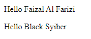

# Function Parameter

---

## Function Parameter

- Kita bisa **mengirim informasi** ke function yang ingin kita panggil
- Untuk melakukan hal tersebut, kita perlu menambahkan **parameter atau argument** di function yang sudah kita buat
- Parameter ditempatkan **di dalam kurung ()** di deklarasi method
- Parameter bisa lebih dari satu, jika lebih dari satu, harus dipisah menggunakan **tanda koma**

---

## Kode : Function Parameter

```js
// Membuat function
function sayHelloWorld(firstName, lastName) {
    document.writeln(`<p>Hello ${firstName} ${lastName}</p>`);
}

// Memanggil function
sayHelloWorld("Faizal", "Al Farizi");
sayHelloWorld("Black", "Syiber"); // boleh berkali-kali
```

**Hasil :**



