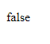

# Function Return Value

---

## Function Return Value

- **Secara default**, function itu **tidak menghasilkan value** apapun, namun jika kita ingin, kita bisa **membuat** sebuah function **mengembalikan value**
- Agar function bisa menghasilkan value, kita bisa menggunakan **kata kunci return** di dalam function nya.
- Dan di dalam block function, untuk menghasilkan nilai tersebut, kita harus menggunakan kata kunci return, lalu diikuti dengan data yang ingin kita hasilkan.
- Function hanya bisa **mengembalikan satu data**, jika kita ingin mengembalikan beberapa data sekaligus, kita bisa menggunakan **Array** sebagai return value nya

---

## Kode : Function Return Value

```js
// Membuat function
function sayHello(firstName, lastName) {
    const say = `Hello ${firstName} ${lastName}`;
    return say;
}

// Memanggil function
const result = sayHello("Faizal", "Al Farizi");
document.writeln(`<p>${result}</p>`);
```

**Hasil :**


---

## Kode : Function Return Value Lebih Dari Satu

```js
function getFinalValue(value) {
    if(value > 90) {
        return "A";
    } else if (value > 80) {
        return "B";
    } else if (value > 70) {
        return "C";
    } else if (value > 60) {
        return "D";
    } else {
        return "E";
    }
}

const finalValue = getFinalValue(76);
document.writeln(`<p>${finalValue}</p>`);
```

**Hasil :**


---

## Menghentikan Eksekusi dengan Return

- Saat kita menggunakan kata kunci **return**, maka kode **setelah** return tersebut **tidak akan dieksekusi**
- Kita bisa menggunakan return untuk **menghentikan eksekusi **sebuah function

---

## Kode : Menghentikan Eksekusi dengan Return

```js
function isContains(array, searchValue) {
    for(const element of array) {
        if(element === searchValue) {
            return true
        }
    }
    return false;
}

const array = [1, 32, 4324, 3, 43, 53, 43, 43, 535, 35, 5];
const search = 10;
const found = isContains(array, search)
document.writeln(`<p>${found}</p>`);
```

**Hasil :**



