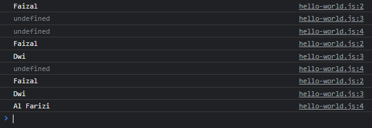

# Optional Parameter

---

## Optional Parameter

- Secara default, **parameter** di function itu **optional**
- Artinya kita **tidak wajib** mengisi value nya ketika memanggil function
- Jika tidak ada value yang kita kirim ke parameter ketika memanggil function, maka secara otomatis parameter tersebut bernilai **undefined**

---

## Kode : Optional Parameter

```js
function sayHello(firstName, middleName, lastName) {
    console.log(firstName);
    console.log(middleName);
    console.log(lastName);
}

sayHello("Faizal");
sayHello("Faizal", "Dwi");
sayHello("Faizal", "Dwi", "Al Farizi");
```



