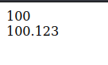
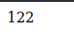

# Tipe Data Number

- JavaScript hanya mendukung **1 tipe data number**, dimana tipe data number di JavaScript bisa berupa **bilangan bulat / bilangan desimal**
  - tipe data = jenis data
- Tipe seperti di bahasa pemrograman lain yang biasanya membedakan tipe data number bilangan bulat dan bilangan desimal, di JavaScript **semuanya disatukan**.

## Kode

```js
document.writeln(100);
        document.writeln("</br>");
        document.writeln(100.123);
```



## Number Notation

- JavaScript mendukung **number notation**, defaultnua ada basis 10, JavaScript juga mendukung binary, hexadecimal dan octal
- **Hexadecimal** : 0xFF
- **Binary** : 0b10101
- **Octal** : 0o10

*script.js*

```js
document.writeln(0b1111010);
```



