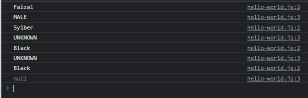

# Default Parameter

---

## Default Parameter

● Sekarang kita tahu bahwa **parameter itu optional**, artinya kita **bisa tidak memberi** value terhadap parameter
● Parameter juga **bisa** kita beri **default value**, artinya jika ketika kita tidak mengirim data ke parameter atau kita mengirim data undefined, maka secara otomatis parameter akan diisi oleh default value

---

## Kode : Default Parameter

```js
function register(name, gender = "UNKNOWN") {
    console.log(name);
    console.log(gender);
}

register("Faizal", "MALE");
register("Syiber");
register("Black", undefined);
register("Black", null);
```

**Hasil :**



