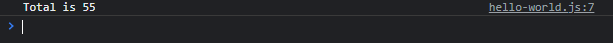

# Rest Parameter

---

## Rest Parameter

- **Rest Parameter** adalah fitur dimana kita bisa mengirim data sebanyak-banyak nya pada satu parameter, dan secara otomatis akan di konversi menjadi Array
- Untuk membuat rest parameter, ada ketentuannya
- Rest parameter **hanya boleh ada satu di function**, tidak boleh lebih dari satu
- Rest parameter hanya boleh berada di posisi **paling akhir**, tidak boleh di depan atau di tengah, kecuali memang cuma ada 1 parameter
- Di bahasa pemrograman lain, ada juga yang bilang ini adalah **variable argument**

---

## Kode : Rest Parameter

```js
function sum(name, ...data) {
    let total = 0;
    for(const item of data) {
        total += item;
    }
    console.log(`Total ${name} is ${total}`);
}

sum("Orange", 2, 3, 4, 6, 7, 8);
sum("Apple", 5, 5, 7, 3, 56, 2);
sum("Banana", 3, 5, 3, 7, 2, 6);
```

**Hasil :**


---

## Spread Syntax

- Kadang kita terlanjur memiliki **data berupa Array**
- Tapi untungnya kita juga bisa **mengirim Array ke Rest Parameter**
- Kita bisa gunakan **… (titik tiga kali)** diikuti dengan array nya ketika memanggil function
- Fitur ini dinamakan **Spread Syntax**

---

## Kode : Spread Syntax di Rest Parameter

```js
function sum(name, ...data) {
    let total = 0;
    for(const item of data) {
        total += item;
    }
    console.log(`Total ${name} is ${total}`);
}

sum("Orange", ...[2, 3, 4, 6, 7, 8]);
const value = [5, 5, 7, 3, 56, 2]
sum("Apple", ...value);
sum("Banana", ...[3, 5, 3, 7, 2, 6]);
```


---

## Arguments Object

- **Sebelum ada** fitur rest parameter, di JavaScript sudah ada fitur yang bernama **arguments object**
- Ini adalah fitur dimana kita bisa **mengambil semua parameter** dalam bentuk array dengan menggunakan object bernama **arguments**
- arguments secara otomatis bisa digunakan di function
- Namun **perlu diingat**, bahwa untuk JavaScript saat ini, lebih baik **disarankan** menggunakan **rest parameter** dibanding **arguments object**

---

## Kode : Arguments Object

```js
function oldSum() {
    let total = 0;
    for (const item of arguments) {
        total += item;
    }

    console.log(`Total is ${total}`);
}

oldSum(1, 2, 3, 4, 5, 6, 7, 8, 9, 10);
```

**Hasil :**

