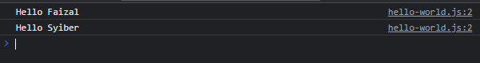
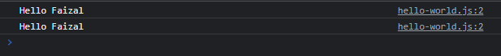

# Function Sebagai Value

---

## Function Sebagai Value

- **Function tidak hanya bisa digunakan** sebagai kode program yang dieksekusi, tapi bisa juga sebagai **value**
- Artinya, function **bisa disimpan di variable**, bisa juga dikirim melalui parameter ke function lainnya

---

## Kode : Function di Variable

```js
function sayHello(name) {
    console.log(`Hello ${name}`);
}

let say = sayHello;

sayHello("Faizal");
say("Syiber");
```



---

## Kode : Function di Parameter

```js
function sayHello(name) {
    console.log(`Hello ${name}`);
}

let say = sayHello;

function giveMeName(callback) {
    callback("Faizal"); // sayHello("Faizal");
}

giveMeName(sayHello);
giveMeName(say); // giveMeName(sayHello)
```

