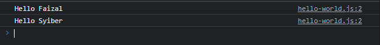
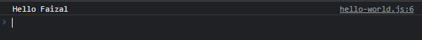

# Anonymous Function

- Sebelumnya kita selalu **membuat function** dengan **nama**
- Kita juga bisa **membuat function tanpa nama function**, atau istilahnya adalah **anonymous function**
- Kita bisa buat anonymous function **dalam sebuah variable** atau bisa juga kita buat ketika **mengisi parameter**

---

## Kode : Anonymous Function di Variable

```js
let say = function(name) {
    console.log(`Hello ${name}`);
}

say("Faizal");
say("Syiber");
```

**Hasil :**



---

## Kode : Anonymous Function di Parameter

```js
function giveMeName(callback) {
    callback("Faizal");
}

giveMeName(function (name) {
    console.log(`Hello ${name}`);
});
```

**Hasil :**

