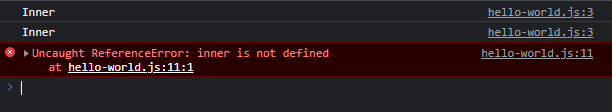

# Function dalam Function

- **Tidak ada batasan** dimana kita bisa membuat function
- Termasuk jika kita ingin **membuat** function di dalam sebuah function, kita bisa melakukannya
- Function yang terdapat di dalam, kita sebut **inner function**
- Inner function **hanya bisa** diakses di tempat kita membuat function nya, **tidak bisa** diakses dari luar function nya

---

## Kode : Function dalam Function

```js
function outer() {
    function inner() {
        console.log("Inner");
    }

    inner();
    inner();
}

outer();
inner(); // ERROR
```

