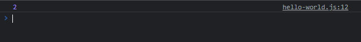
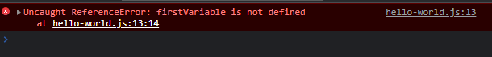
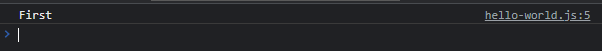

# Scope

---

## Scope

- **Scope** merupakan area akses sebuah data
- Ada dua jenis scope, **global scope** dan **local scope**.
- Setiap kita **membuat function**, maka kita akan **membuat local scope** untuk function tersebut
- Data di **global scope bisa diakses dari local scope**, namun data **di local scope hanya bisa di akses di local scope** tersebut atau di scope local dibawahnya (dalam kasus function dalam function)

---

## Kode : Global Scope 

```js
// global scope
let counter = 0;

// global scope
function hitMe() {
    // local scope function hitMe
    counter++;
}

hitMe();
hitMe();

console.log(counter);
```

**Hasil :**



---

## Kode : Local Scope

```js
function first() {
    let firstVariable = "First";
}

function second() {
    let secondVariable = "Second";
}

first();
second();

// global scope
console.log((firstVariable));
console.log((secondVariable));
```

**Hasil :**



---

## Kode : Nested Function Scope

```js
function first() {
    let firstVariable = "First";

    function second() {
        console.log(firstVariable);
    }

    second();
}

first();
```

**Hasil :**

