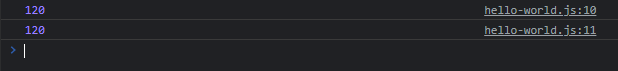
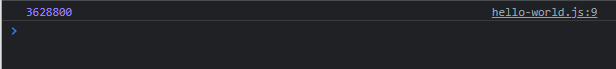

# Recursive Function

- **Recursive function** adalah kemampuan function memanggil function dirinya sendiri
- Kadang memang ada banyak problem, yang lebih mudah diselesaikan menggunakan recursive function, seperti contohnya kasus factorial

---

## Kode : Factorial Loop

```js
function factorial(value) {
    let result = 1;
    for(let i = 1; i <= value; i++) {
        result *= i;

    }
    return result;
}

console.log(factorial(5));
console.log(1 * 2 * 3 * 4 * 5);
```

**Hasil :**



---

## Kode : Factorial Recursive

```js
function factorialRecursive(value) {
    if(value === 1) {
        return 1;
    } else {
        return value * factorialRecursive(value - 1);
    }
}

console.log(factorialRecursive(10));
// 5 * factorialRecursive(4)
// 5 * 4 * factorialRecursive(4)
// 5 * 4 * factorialRecursive(4)
// 5 * 4 * 3 * factorialRecursive(4)
// 5 * 4 * 3 * 2 * factorialRecursive(4)
// 5 * 4 * 3 * 2 * 1
```

