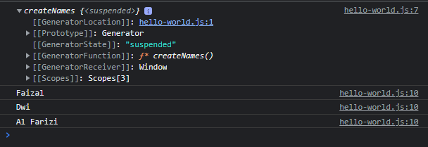
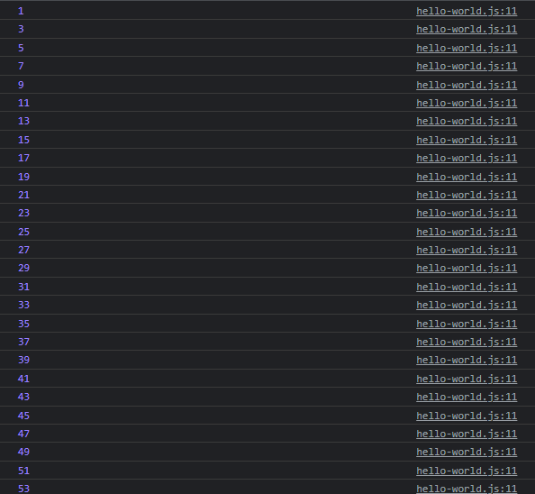
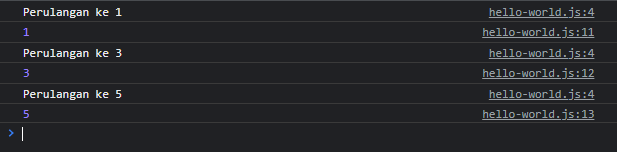
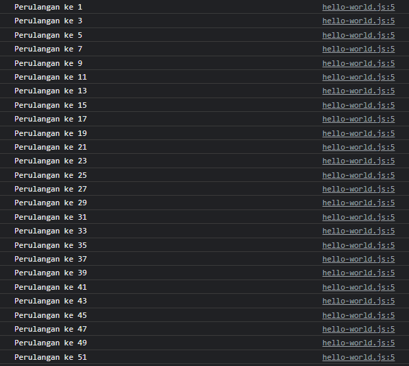

# Function Generator

---

## Function Generator

- **Function generator** adalah function yang digunakan untuk **membuat data generator**
- **Generator** adalah data yang bisa di interasi seperti Array
- Untuk membuat function generator, kita perlu menggunakan **tanda * (bintang)** setelah kata function
- Dan untuk mengembalikan data di tiap iterasi, kita bisa gunakan kata kunci **yield diikuti datanya**
- generator itu hanya bisa iterabel saja tapi tidak bisa diakses dengan index
---

## Kode : Function Generator Sederhana

```js
function* createNames() {
    yield "Faizal";
    yield "Dwi";
    yield "Al Farizi";
}

console.log(createNames());
const names = createNames();
for(const name of names) {
    console.log(name);
}
```

**Hasil :**



---

## Kode : Function Generator Kompleks

```js
function* buatGanjil(value) {
    for(let i = 1; i <= value; i++) {
        if(i % 2 == 1) {
            yield i;
        }
    }
}

const numbers = buatGanjil(100);
for(const number of numbers) {
    console.log(number);
}
```

**Hasil :**



---

## Lazy Evaluation

- Generator itu sifatnya **lazy**
- Jadi artinya jika **datanya belum kita ambil** dari generator, maka **yield selanjutnya tidak akan di eksekusi**

---

## Kode : Lazy Generator

```js
function* buatGanjil(value) {
    for(let i = 1; i <= value; i++) {
        if(i % 2 === 1) {
            console.log(`Perulangan ke ${i}`);
            yield i;
        }
    }
}

const numbers = buatGanjil(100);
console.log(numbers.next().value);
console.log(numbers.next().value);
console.log(numbers.next().value);
```

**Hasil :**



---

ketika kita mengakses functionnya tidak akan dieksekusi karena kita tidak membutuhkan function tersebut itu function generator dengan sifat lazy.

```js
function* buatGanjil(value) {
    for(let i = 1; i <= value; i++) {
        if(i % 2 === 1) {
            console.log(`Perulangan ke ${i}`);
            yield i;
        }
    }
}

const numbers = buatGanjil(100);
```

**Hasil :**


---

sedangkan function biasa itu eager artinya jika kita akses walaupun tidak kita gunakan maka functio tersebut akan tetap dieksekusi.

```js
function buatGanjilArray(value) {
    const result = [];
    for(let i = 1; i <= value; i++) {
        if(i % 2 === 1) {
            console.log(`Perulangan ke ${i}`);
            result.push(i);
        }
    }
    return result;
}

const numbers = buatGanjilArray(100);
```

**Hasil :**



---

> jadi function generator bersifat lazy artinya jika dibutuhkan baru dieksekusi
> jadi menghemat proses dan hemat data karena baru dibutuhkan baru diambil ketika tidak dibutuhkan maka tidak akan dieksekusi.