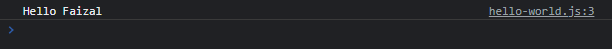
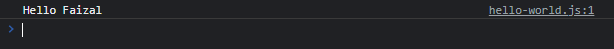
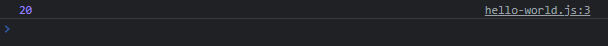
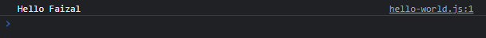
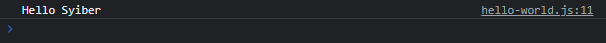

# Arrow Function

---

## Arrow Function

- **Arrow function** adalah alternatif pembuatan function yang **lebih sederhana** dari function biasanya
- Namun terdapat limitasi dan juga tidak bisa digunakan di semua situasi
- Dinamakan arrow function karena menggunakan **tanda =>** (seperti panah)
- Berikut contoh beberapa kekurangan arrow function :
    - tidak memiliki fitur arguments object
    - tidak bisa menggunakan function generator
    - tidak bisa mengakses this (yang nanti akan dibahas di function di object)
    - tidak bisa mengakses  super (yang nanti akan dibahas di JavaScript Object Oriented Programming)

---

## Kode : Membuat Arrow Function

```js
const sayHello = (name) => {
    const say = `Hello ${name}`;
    console.log(say);
}

sayHello("Faizal");
```

**Hasil :**



---

## Arrow Function Tanpa Block

- Jika sebuah arrow function isinya sederhana, misal hanya **satu baris**
- Kita bisa membuat arrow function **tanpa** harus menggunakan **block**

---

## Kode : Arrow Function Tanpa Block

```js
const sayHello = (name) => console.log(`Hello ${name}`);

sayHello("Faizal");
```

**Hasil :**



---

## Arrow Function Return Value

- Arrow function bisa **mengembalikan value**, sama seperti function biasanya
- **Jika menggunakan block**, maka kita perlu menggunakan kata **kunci return**
- Jika **tidak menggunakan block**, kita **tidak perlu** menggunakan **kata kunci return **

---

## Kode : Arrow Function Return Value

```js
const sum = (first, second) => first + second;

console.log(sum(10, 10));
```

**Hasil :**



---

## Arrow Function Tanpa Kurung Parameter

Jika **parameter** di arrow function **hanya satu**, kita **bisa tidak menggunakan kurung pada parameter**

---

## Kode : Arrow Function Tanpa Kurung Parameter

```js
const sayHello = name => console.log((`Hello ${name}`));
sayHello("Faizal");
```

**Hasil :**



---

## Kode : Arrow Function Sebagai Parameter

- Karena arrow function **sama seperti** anonymous function
- Jadi kita juga **bisa** menggunakan arrow function sebagai **parameter di function lain**

---

## Kode : Arrow Function Sebagai Parameter

```js
// Anonymouse Function
// giveMeName(function(name) {
//     console.log(`Hello ${name}`);
// });

// Arrow Function
function giveMeName(callback) {
    callback("Syiber");
}

giveMeName((name) => console.log(`Hello ${name}`));
```

**Hasil :**

