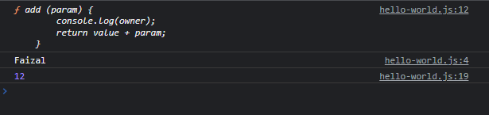

# Closure

---

## Closure

- **Closure** adalah kombinasi function dan bundel referensi ke data disekitarnya.
- Oke **agak membingungkan memang**, apalagi untuk yang baru pertama belajar 
- Kita sudah tahu bahwa **local scope** tidak bisa diakses **di luar scope nya**
- Dengan **kemampuan closure**, kita bisa membuat sebuah **function di local scope** dan referensi ke data di sekitar local scope tersebut, keluar scope nya

---

## Kode : Closure

```js
function createAdder(value) {
    const owner = "Faizal";
    function add (param) {
        console.log(owner);
        return value + param;
    }

    return add;
}

const addTwo = createAdder(2);
console.log(addTwo);
// function addTwo(param) {
//     console.log("Faizal");
//     return 2 * param;
// }

const addTen = createAdder(10);
console.log(addTwo(10));
// function addTwo(param) {
//     console.log("Faizal");
//     return 10 * param;
// }
```

**Hasil :**

