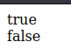

# Tipe Data Boolean

- **Tipe data boolean** = tipe data yang berisikan data kebenaran, artinya hanya ada 2 data, benar dan salah (yes atau no)
- **Benar** direpresentasikan dengan kata kunci **true**, dan **salah** direpresentasikan dengan kata kunci **false**
- Walaupun tipe data boolean merupakan tipe data yang **sangat sederhana**, tapi tipe data boolean akan **banyak** digunakan d berbagai fitur pemrograman.

## Kode

```js
document.writeln(true)
document.writeln("</br>")
document.writeln(false)
```



