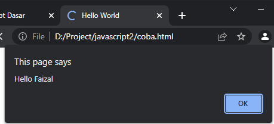
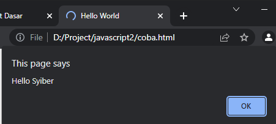

# Object Method

---

## Object Method

- **Pada tipe data object**, kita sudah membahas tentang property di object
- Karena sebenarnya **function** juga merupakan salah satu **tipe data**, jadi function pun sebenarnya bisa **ditambahkan** sebagai **property di object**
- **Cara pembuatannya** pun sama dengan function sebagai value
- Function di object kadang disebut juga sebagai **Object Method**

---

## Kode : Membuat Object dengan Method

```js
const person = {
    name: "Faizal",
    sayHello: function(name) {
        alert(`Hello ${name}`);
    }
}

person.sayHello("Faizal");
```

atau

```js
function sayHello(name) {
    alert(`Hello ${name}`);
}
const person = {
    name: "Faizal",
    sayHello: sayHello
}

person.sayHello("Faizal");
```

**Hasil :**



---

## Kode : Menambah Method ke Object

```js
const person = {
    name: "Faizal"
}

person.sayHello = function(name) {
    alert(`Hello ${name}`);
}

person.sayHello("Syiber");
```

**Hasil :**



