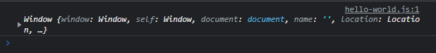
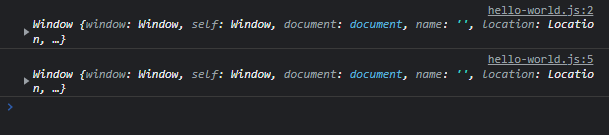
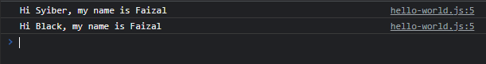

# Kata Kunci this

---

## Kata Kunci this

- **Kata kunci this** adalah referensi ke object milik siapa
- **Tiap lokasi** kata kunci this, bisa berbeda-beda referensi pemilik nya
- Dalam **Object Method**, this merupakan referensi ke object pemilik function nya
- Di **global scope**, this merupakan referensi ke global object (di browser biasanya Window)
- **Dalam function**, this merupakan referensi ke global object (di browser biasanya Window)
- **Di function dengan strict mode** (akan dibahas nanti), this adalah undefined
- **Dalam event**, this merupakan referensi ke element yang menerima event (dibahas di materi Document Object Model)

---

## Kode : this di Global Scope

```js
console.log(this); // Window
```

**Hasil :**



---

## Kode : this di Function

```js
function sample() {
    console.log(this);

    function inner() {
        console.log(this);
    }

    inner(); // Window
}

sample(); // Window
```

**Hasil :**



---

## Kode : this di Object Method

```js
const person = {
    name: "Faizal",
    sayHello: function(name) {
        // this = person
        console.log(`Hi ${name}, my name is ${this.name}`);
    }
}

person.sayHello("Syiber");
person.sayHello("Black");
```

**Hasil :**



