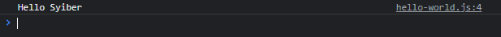
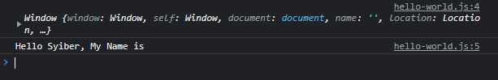

# Arrow Function di Object

---

## Arrow Function di Object

- Sebelumnya kita sudah bahas tentang **Arrow Function**
- Arrow Function juga bisa kita gunakan di sebagai **Object Method**
- Namun perlu diketahui, Arrow Function **tidak bisa** digunakan untuk **mengakses arguments object, function generator, kata kunci this dan kata kunci super** (dibahas di materi JavaScript Object Oriented Programming)
- Jadi pastikan gunakan Arrow Function hanya memang ketika kita **tidak butuh** fitur-fitur diatas

---

## Kode : Arrow Function di Object Method

```js
const person = {
    name: "Faizal",
    sayHello: (name) => {
        console.log(`Hello ${name}`);
    }
};

person.sayHello("Syiber");
```

**Hasil :**



---

## Kode : this di Arrow Function Object

```js
const person = {
    name: "Faizal",
    sayHello: (name) => {
        console.log(this); // window
        console.log(`Hello ${name}, My Name is ${this.name}`);
    }
};

person.sayHello("Syiber"); // Hello Budi Name is
```

**Hasil :**

