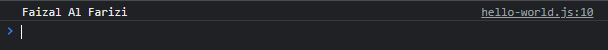
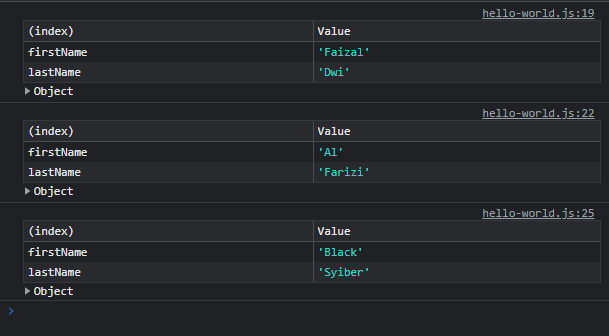

# Getter dan Setter

---

## Getter dan Setter

- **Getter dan Setter** adlah kemampuan **membuat function** yang berbeda untuk **mengambil data** (Getter) dan **mengubah data** (Setter) pada sebuah **property di Object**
- Dengan menggunakan Getter dan Setter, kita bisa melakukan hal apapun dalam function sebelum sebuah property di akses atau diubah, misal menambah validasi dan lain-lain

---

## Kode : Getter

```js
const person = {
    firstName: "Faizal",
    lastName: "Al Farizi",

    // property function biasa
    // fullName: function() {
    //     return `${this.firstName} ${this.lastName}`;
    // }

    // getter
    get fullName() {
        return `${this.firstName} ${this.lastName}`;
    }
}

// otomatis memanggil get fullName()
// console.log(person.fullName()); // Memanggil function biasa
console.log(person.fullName); // getter
```

**Hasil :**



---

## Kode : Setter

```js
const person = {
    firstName: "Faizal",
    lastName: "Al Farizi",

    // getter
    get fullName() {
        return `${this.firstName} ${this.lastName}`;
    },
    
    // setter
    set fullName(value) {
        const array = value.split(" ");
        this.firstName = array[0];
        this.lastName = array[1];
    }
}

person.fullName = "Faizal Dwi";
console.table(person);

person.fullName = "Al Farizi";
console.table(person);

person.fullName = "Black Syiber";
console.table(person);
```

**Hasil :**

