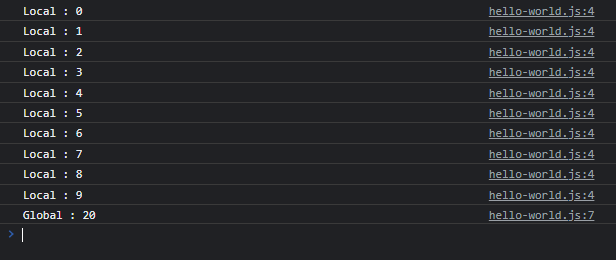
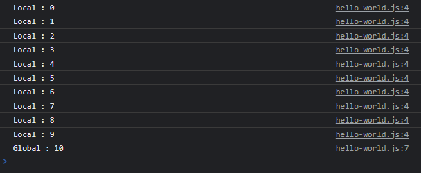

# Masalah Variable var

---

## Masalah Variable var

- Sebelumnya sudah dijelaskan bahwa penggunaan **var sudah tidak direkomendasikan lagi**, dan **diganti dengan let**
- Pertanyaannya **kenapa**?
- Alasan var tidak direkomendasikan digunakan lagi adalah, karena var tidak memiliki **block scope**, artinya dia tidak mengikat ke local scope yang sebelumnya sudah kita bahas
- Karena masalah ini, var bisa tidak terprediksi
- Kita akan buat contoh penggunaan var dan let

---

## Kode : Menggunakan let

```js
let i = 20;

for(let i = 0; i < 10; i++) {
    console.log(`Local : ${i}`);
}

console.log(`Global : ${i}`);
```

**Hasil :**



---

## Kode : Menggunakan var

```js
var i = 20;

for(var i = 0; i < 10; i++) {
    console.log(`Local : ${i}`);
}

console.log(`Global : ${i}`);
```

**Hasil :**



> saat buat global scope, kemudian buat lagi di local scope jadi variable bisa diubah walaupun scope nya berbeda