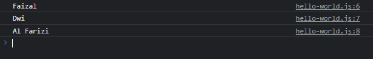
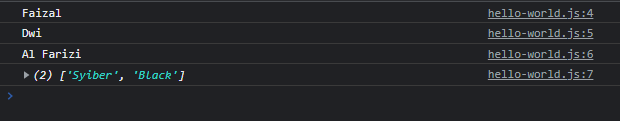
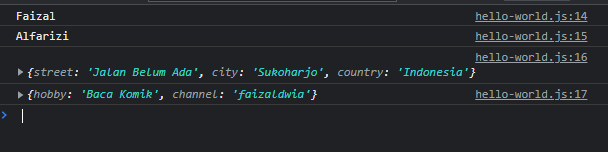
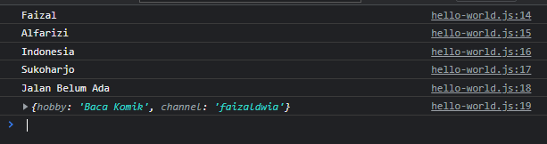
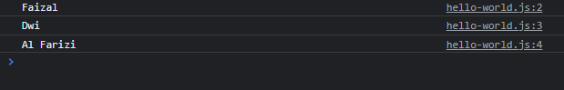
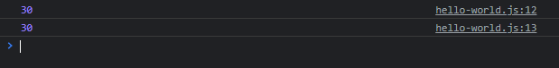
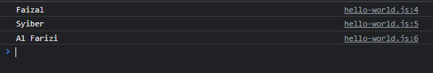
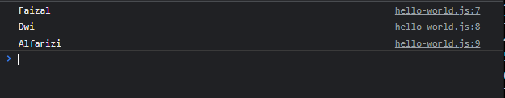
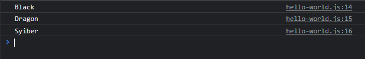

# Destructuring

---

## Destructuring

- **Destructuring** adalah fitur yang bisa digunakan untuk **membongkar value-value** di array atau object ke dalam variable-variable
- Fitur ini sangat mempermudah kita ketika ingin mengambil data dari array atau object tanpa harus melakukan pengambilan data satu persatu

---

## Kode : Mengambil Data di Array

```js
const names = ["Faizal", "Dwi", "Al Farizi"];
const firstName = names[0];
const middleName = names[1];
const lastName = names[2];

console.log(firstName);
console.log(middleName);
console.log(lastName);
```

**Hasil :**



---

## Kode : Destructuring Array

```js
const names = ["Faizal", "Dwi", "Al Farizi", "Syiber", "Black"];
const [firstName, middleName, lastName, ...others] = names;

console.log(firstName);
console.log(middleName);
console.log(lastName);
console.log(others);
```

**Hasil :**



---

## Kode : Mengambil Data di Object

```js
const person = {
    firstName: "Faizal",
    lastName: "Alfarizi",
    address: {
        street: "Jalan Belum Ada",
        city: "Sukoharjo",
        country: "Indonesia"
    },
    hobby: "Baca Komik",
    channel: "faizaldwia"
};

const firstName = person.firstName;
const lastName = person.lastName;
```

---

## Kode : Destructuring Object

```js
const person = {
    firstName: "Faizal",
    lastName: "Alfarizi",
    address: {
        street: "Jalan Belum Ada",
        city: "Sukoharjo",
        country: "Indonesia"
    },
    hobby: "Baca Komik",
    channel: "faizaldwia"
};

let {firstName, lastName, address, ...others} = person;
console.log(firstName);
console.log(lastName);
console.log(address);
console.log(others);
```

**Hasil :**



---

## Kode : Destructuring Nested Object

```js
const person = {
    firstName: "Faizal",
    lastName: "Alfarizi",
    address: {
        street: "Jalan Belum Ada",
        city: "Sukoharjo",
        country: "Indonesia"
    },
    hobby: "Baca Komik",
    channel: "faizaldwia"
};

let {firstName, lastName, address: {country, city, street}, ...others} = person;
console.log(firstName);
console.log(lastName);
console.log(country);
console.log(city);
console.log(street);
console.log(others);
```

**Hasil :**



---

## Destructuring Function Parameter

- Destructuring **tidak hanya** bisa dilakukan di variable, tapi juga bisa dilakukan di **function parameter**
- Hal ini membuat kita mudah ketika ingin **mengambil nested data dalam array** atau **object dalam function**

---

## Kode : Destructuring di Function Parameter (1)

```js
function displayPerson({firstName, middleName, lastName}) {
    console.log(firstName);
    console.log(middleName);
    console.log(lastName);
}

const person = {
    firstName: "Faizal",
    middleName: "Dwi",
    lastName: "Al Farizi"
};

displayPerson(person);
```

**Hasil :**



---

## Kode : Destructuring di Function Parameter (2)

### tanpa destructuring : 

```js
function sum(array) {
    return array[0] + array[1];
}

console.log(sum([10, 20]));
console.log(sum([20, 10]));
```

---

### dengan destructuring : 

```js
function sum([first, second]) {
    return first + second;
}

console.log(sum([10, 20]));
console.log(sum([20, 10]));
```

dengan hasil yang sama

**Hasil :**



---

## Default Value

- Yang paling menarik di destructuring adalah, kita bisa **menambahkan default value**
- Jadi misal kita kita melakukan **destructuring terhadap array**, ternyata **tidak ada datanya**, maka kita bisa **menambahkan default value**
- Begitu juga pada **object**, jika ternyata property nya tidak ada, maka kita bisa menambahkan default value

---

## Kode : Default Value Destructuring Array

```js
const names = ["Faizal", "Syiber"];
const [firstName, middleName = "Dwi", lastName = "Al Farizi"] = names;

console.log(firstName);
console.log(middleName);
console.log(lastName);
```

**Hasil :**



---

## Kode : Default Value Destructuring Object

```js
const person = {
    firstName: "Faizal",
    lastName: "Alfarizi"
};

const {firstName, middleName = "Dwi", lastName} = person;
console.log(firstName);
console.log(middleName);
console.log(lastName);
```

**Hasil :**



---

## Menggunakan Nama Variable Lain

- Saat melakukan **destructuring di Array**, kita bisa dengan **mudah membuat nama variable sesuka kita**
- Namun pada saat melakukan destructuring object, kita harus membuat nama variable sama dengan nama property
- Kita juga bisa menggunakan **nama variable lain** saat melakukan destructuring object jika kita mau

---

## Kode : Menggunakan Nama Variable Lain

```js
const person = {
    firstName: "Black",
    middleName: "Dragon",
    lastName: "Syiber"
}

const {
    firstName: namaDepan,
    middleName: namaTengah = "Dwi",
    lastName: namaBelakang
} = person;

console.log(namaDepan);
console.log(namaTengah);
console.log(namaBelakang);
```

**Hasil :**

