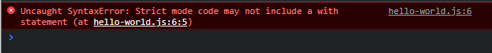

# Strict Mode

---

## Strict Mode

- Saat kita **menjalankan** kode program JavaScript, secara **default** kode program kita berjalan dalam mode **tidak strict**, atau istilahnya **sloppy mode**
- Pada **ECMAScript 5**, diperkenalkan **mode strict**, dimana ketika strict mode dijalankan, maka akan merubah beberapa cara kerja di JavaScript, seperti :
    - Merubah beberapa JavaScript error dari yang tadinya **silent error**, menjadi **throw error** (terlihat)
    - Memperbaiki beberapa kesalahan engine JavaScript untuk optimisasi
    - Menolak beberapa kode perintah yang kedepannya akan digunakan di ECMAScript
- https://developer.mozilla.org/en-US/docs/Web/JavaScript/Reference/Strict_mode/Transitioning_to_strict_mode

---

## Cara Menyalakan Strict Mode

- Untuk menyalakan strict mode, kita bisa menambahkan `use strict` pada baris awal file javascript kita
- Atau bisa juga ditambahkan di awal function kita

---

## Kode : Strict Mode

```js
function useStrictMode() {
    'use strict';
    const person = {
        firstName: "Faizal"
    }

    // error
    with(person) {
        console.log(firstName);
    }
}

useStrictMode();
```

**Hasil :**

