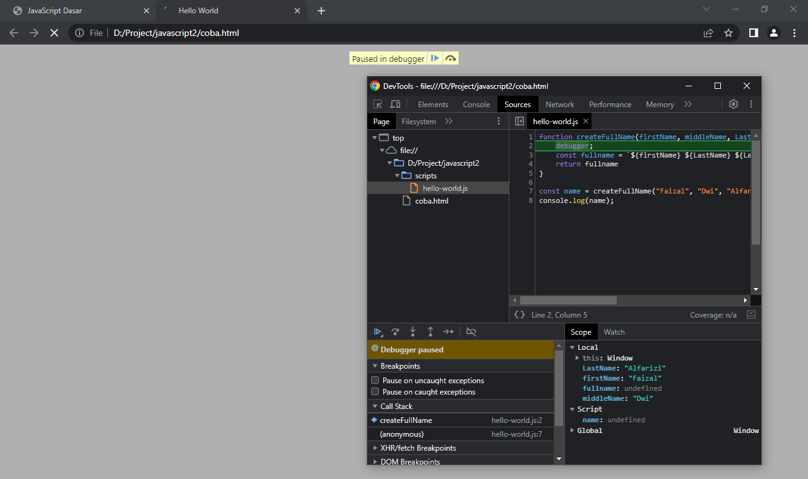
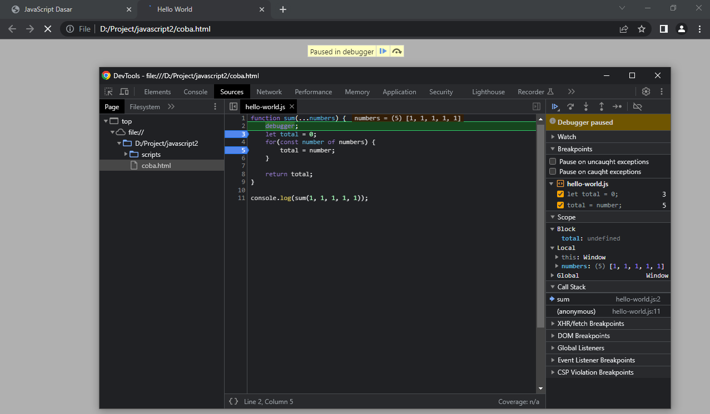

# Debugger

---

## Debugger

- Debugger **digunakan** untuk melakukan proses debugging
- Debugging adalah **proses mencari bug** (masalah) yang biasa terjadi di kode program kita
- Dengan debugger kita bisa menghentikan kode program di posisi yang kita inginkan (breakpoint), lalu melihat semua isi variable yang ada pada saat kode program sedang berhenti

---

## Kode : Debugger

```js
function createFullName(firstName, middleName, LastName) {
    debugger;
    const fullname = `${firstName} ${LastName} ${LastName}`;
    return fullname
}

const name = createFullName("Faizal", "Dwi", "Alfarizi");
console.log(name);
```

**Hasil :**



---

```js
function sum(...numbers) {
    debugger;
    let total = 0;
    for(const number of numbers) {
        total = number;
    }

    return total;
}

console.log(sum(1, 1, 1, 1, 1));
```

**Hasil :**

