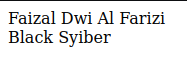
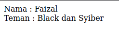
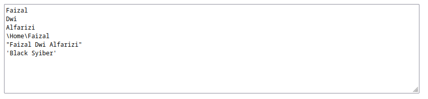

# Tipe Data String

- **Tipe data string / text** = tipe data yang berisikan kumpulan kosong / lebih karakter
- Sebelumnya kita sudah pernah menggunakan string ketika membuat **program hello world**
- di JavaScript untuk membuat data dengan tipe string, kita perlu menggunakan **"** (petik 2) / **'** (petik 1) sebelum dan setelah isi text nya

### Kode

```js
document.writeln("Faizal Dwi Al Farizi");
document.writeln("</br>");
document.writeln('Black Syiber');
```

**Hasil :**



---

## Menambah String

- Data string bisa digabungkan menggunakan operator **+** (plus)

### Kode

```js
document.writeln("Nama : " + "Faizal");
document.writeln("</br>");
document.writeln("Teman : " + "Black" + " dan " + "Syiber");
```

**Hasil :**



---

## Escape Sequence

- JavaScript mendukung escape sequence di string. 
- Escape sequence = karakter khusus, seperti ENTER, TAB, " (kutip 2), dll.
- Berikut contoh escape sequence yang didukung oeh JavaScript di data string.

<table border="1" width="100%">
    <tr>
        <td>\n</td>
        <td>ENTER</td>
    </tr>
    <tr>
        <td>\t</td>
        <td>TAB</td>
    </tr>
    <tr>
        <td>\'</td>
        <td>'</td>
    </tr>
    <tr>
        <td>\"</td>
        <td>"</td>
    </tr>
    <tr>
        <td>\\</td>
        <td>\</td>
    </tr>
</table>

### Kode

```js
document.writeln("<textarea cols='100' rows='10'>");
document.write("Faizal \nDwi \nAlfarizi\n");
document.write("\\Home\\Faizal\n");
document.write("\"Faizal Dwi Alfarizi\"\n");
document.write("\'Black Syiber\'\n");
document.writeln("</textarea>");
```

**Hasil :**



