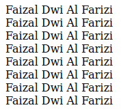
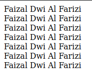
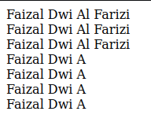
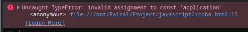

# Variable

## Susahnya Tanpa Variable

kita buat dulu script yang tanpa variable

*script.js*

```js
document.writeln("Faizal Dwi Al Farizi");
document.writeln("</br>");
document.writeln("Faizal Dwi Al Farizi");
document.writeln("</br>");
document.writeln("Faizal Dwi Al Farizi");
document.writeln("</br>");
document.writeln("Faizal Dwi Al Farizi");
document.writeln("</br>");
document.writeln("Faizal Dwi Al Farizi");
document.writeln("</br>");
document.writeln("Faizal Dwi Al Farizi");
document.writeln("</br>");
document.writeln("Faizal Dwi Al Farizi");
document.writeln("</br>");
document.writeln("Faizal Dwi Al Farizi");
document.writeln("</br>");
```

**Hasil :**



---

- tiba2 kita pengen mengganti misal al farizi nya digabung, maka kita harus ubah semua.
- kan pasti capek ya, apalagi jika 1000x

---

## Variable

- **Variable** = tempat untuk menyimpan data
- Dengan menyimpan data di variable, kita bisa **menggunakan lagi** dengan menyebutkan nama variable nya
- Untuk membuat variable di JavaScript, kita bisa menggunakan kata kunci **var** diikuti dengan nama variablenya
- JavaScript adalah **dynamic language**, artinya variable di JavaScript **tidak terpaku** harus menggunakan **1 tipe data**, kita bisa mengubah2 tipe data di variable yang sama.

### kode

```js
var fullName;
var firstName;
var middleName;
var lastName;
```

---

## Mengubah Value di Variable

- Setelah variable di deklarasikan, kita bisa **mengubah value / nilai** di dalam variable tersebut
- Untuk mengubahnya, kita bisa menggunakan perintah nama variable diikuti dengan tanda **= (sama dengan)** lalu diikuti dengan value / nilainya.

### Kode

```js
var fullName;
var firstName;
var middleName;
var lastName;

fullName = "Faizal Dwi Al Farizi";
firstName = "Faizal";
middleName = "Dwi";
lastName = "Al Farizi";
```

---

## Membuat Variable Langsung Dengan Value

- di JavaScript juga kita bisa mendeklarasikan sebuah variable, **langsung dengan isi value** nya
- Caranya kita bisa menggunakan kata kunci **var**, diikuti **nama variable**, lalu diikuti dengan tanda **= (sama dengan)**, dan di ikuti dengan value / nilainya

### Kode

*script.js*

```js
var firstName = "Faizal Dwi";
var lastName = "Al Farizi";
var fullName = "Faizal Dwi" + " " + "Al Farizi";
```

---

## Mengakses Variable

- Salah 1 keuntungan menggunakan variable adalah variable bisa **digunakan kembali**
- Hal ini akan mempermudah ketika **membutuhkan data yang sama berkali2**
- Untuk mengakses variable, kita cukup **menyebutkan** nama variable nya

### kode

*script.js*

```js
var firstName = "Faizal Dwi";
var lastName = "Al Farizi";
var fullName = "Faizal Dwi" + " " + "Al Farizi";

document.writeln(fullName);
document.writeln("</br>");
document.writeln(fullName);
document.writeln("</br>");
document.writeln(fullName);
document.writeln("</br>");
document.writeln(fullName);
document.writeln("</br>");
document.writeln(fullName);
document.writeln("</br>");
document.writeln(fullName);
document.writeln("</br>");
document.writeln(fullName);
document.writeln("</br>");
```

**Hasil :**



---

*script.js*

```js
var firstName = "Faizal Dwi";
var lastName = "Al Farizi";
var fullName = "Faizal Dwi" + " " + "Al Farizi";

document.writeln(fullName);
document.writeln("</br>");
document.writeln(fullName);
document.writeln("</br>");
document.writeln(fullName);

fullName = "Faizal Dwi A";

document.writeln("</br>");
document.writeln(fullName);
document.writeln("</br>");
document.writeln(fullName);
document.writeln("</br>");
document.writeln(fullName);
document.writeln("</br>");
document.writeln(fullName);
document.writeln("</br>");
```

**Hasil :**



---

## Kata Kunci let dan const

- **Sebelum tahun 2015**, kata untuk membuat variable hanya bisa menggunakan kata kunci **var**
- Namun **tahun 2015** sejak versi ECMAScript 2015, diperkenalkan kata kunci baru untuk membuat variable, **let dan const**
- JavaScript sekarang tidak direkomendasikan lagi menggunakan kata kunci var untuk membuat variable, namun diganti dengan let, hal ini dikarenakan **ada masalah dari desain awal var** (akan kita bahas di chapter tersendiri)

### Kode

*script.js*

```js
let firstName = "Faizal Dwi";
let lastName = "Al Farizi";
let fullName = "Faizal Dwi" + " " + "Al Farizi";

document.writeln(fullName);
document.writeln("</br>");
document.writeln(fullName);
document.writeln("</br>");
document.writeln(fullName);

fullName = "Faizal Dwi A";

document.writeln("</br>");
document.writeln(fullName);
document.writeln("</br>");
document.writeln(fullName);
document.writeln("</br>");
document.writeln(fullName);
document.writeln("</br>");
document.writeln(fullName);
document.writeln("</br>");
```

---

## Kata Kunci const

- Kata kunci let itu seperti kata kunci var, dimana data di variable tersebut **bisa diubah2** sesuka kita.
- Sedangakn kata kunci const berbeda, ketika sebuah variable sudah diisi di variable const, maka variable tersebut **tidak bisa diubah** lagi valuenya
- Variable sejenis ini kadang dibilang juga **constant**

### Kode

```js
const application = "Belajar JavaScript Dasar";

application = "Gak Mau Belajar"
```

> untuk melihat errornya : 
1. buka Inspect dibrowser
2. bagian console

    **artinya** : mencoba merubah data variable yang tipe varible nya constant.

