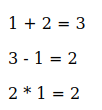
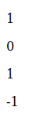

# Operator Matematika

Javascript mendukung **banyak sekali** operator Matematika untuk tipe data Number, seperti:

-   Operator Aritmatika
-   Operator Augmented Assignments
-   Operator Unary
-   Dll

---

## Operator Aritmatika

<table border="1" width="100%">
    <tr>
        <th>Operator</th>
        <th>Keterangan</th>
    </tr>
    <tr>
        <td>+</td>
        <td>Pertambahan</td>
    </tr>
    <tr>
        <td>-</td>
        <td>Pengurangan</td>
    </tr>
    <tr>
        <td>*</td>
        <td>Perkalian</td>
    </tr>
    <tr>
        <td>**</td>
        <td>Exponensial / Pangkat</td>
    </tr>
    <tr>
        <td>/</td>
        <td>Pembagian</td>
    </tr>
    <tr>
        <td>%</td>
        <td>Sisa Bagi</td>
    </tr>
</table>

### Kode

_script.js_

```js
let result = 1 + 2; // 3
document.writeln("<p>1 + 2 = " + result + "</p>");
let originalResult = result; //3

result = result - 1; // 2
document.writeln("<p>" + originalResult + " - 1 = " + result + "</p>");
originalResult = result;

result = result * 1; // 4
document.writeln("<p>" + originalResult + " * 1 = " + result + "</p>");
originalResult = result;
```

**Hasil :**



---

## Operator Augmented Assignments

<table border="1" width="100%">
    <tr>
        <th>Operator Matematika</th>
        <th>Operator Augmented Assignments</th>
    </tr>
    <tr>
        <td>result = result + 10</td>
        <td>resut += 10</td>
    </tr>
    <tr>
        <td>result = result - 10</td>
        <td>resut -= 10</td>
    </tr>
    <tr>
        <td>result = result * 10</td>
        <td>resut *= 10</td>
    </tr>
    <tr>
        <td>result = result ** 10</td>
        <td>resut **= 10</td>
    </tr>
    <tr>
        <td>result = result / 10</td>
        <td>resut /= 10</td>
    </tr>
    <tr>
        <td>result = result % 10</td>
        <td>resut %= 10</td>
    </tr>
</table>

### Kode

```js
let result = 1 + 2; // 3
document.writeln("<p>1 + 2 = " + result + "</p>");
let originalResult = result; //3

result -= 1; // 2
document.writeln("<p>" + originalResult + " - 1 = " + result + "</p>");
originalResult = result;

result *= 1; // 4
document.writeln("<p>" + originalResult + " * 1 = " + result + "</p>");
originalResult = result;
```

---

## Operator Unary

Operator yang cukup membutuhkan 1 data

<table border="1" width="100%">
    <tr>
        <th>Operator</th>
        <th>keterangan</th>
    </tr>
    <tr>
        <td>+</td>
        <td>Menandakan nilai positif</td>
    </tr>
    <tr>
        <td>-</td>
        <td>Menandakan nilai negatif</td>
    </tr>
    <tr>
        <td>++</td>
        <td>Increment, menaikan 1 angka</td>
    </tr>
    <tr>
        <td>--</td>
        <td>Decrement, menurunkan 1 angka</td>
    </tr>
</table>

### Kode

```js
let result = +1;
document.writeln("<p>" + result + "</p>");

result--;
document.writeln("<p>" + result + "</p>");

result++;
document.writeln("<p>" + result + "</p>");

result = -result;
document.writeln("<p>" + result + "</p>");
```

**Hasil :**


