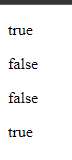

# Operasi Perbandingan

-   Operasi perbandingan = operasi untuk membandingkan 2 buah data
-   Operasi perbandingan = operasi yang menghasilkan nilai boolean (benar / salah)
-   Jika hasil operasinya adalah benar, maka nilainya adalah true
-   Jika hasil operasinya adalah salah, maka nilainya adalah false

---

## Tabel

<table border="1" width="100%">
    <tr>
        <th>Operator</th>
        <th>Keterangan</th>
    </tr>
    <tr>
        <td>&gt;</td>
        <td>Lebih Dari</td>
    </tr>
    <tr>
        <td>&lt;</td>
        <td>Kurang Dari</td>
    </tr>
    <tr>
        <td>&gt;=</td>
        <td>Lebih Dari Sama Dengan</td>
    </tr>
    <tr>
        <td>&lt;=</td>
        <td>Kurang Dari Sama Dengan</td>
    </tr>
    <tr>
        <td>==</td>
        <td>Sama Dengan</td>
    </tr>
    <tr>
        <td>==</td>
        <td>Sama Dengan Dan Sama Tipe</td>
    </tr>
    <tr>
        <td>!=</td>
        <td>Tidak Sama Dengan</td>
    </tr>
    <tr>
        <td>!==</td>
        <td>Tidak Sama Dengan / Tidak Sama Tipe</td>
    </tr>
</table>

### Kode

```js
let result = 5 == "5";
document.writeln("<p>" + result + "</p>");

result = 5 === "5";
document.writeln("<p>" + result + "</p>");

result = 5 > 10;
document.writeln("<p>" + result + "</p>");

result = 5 < 10;
document.writeln("<p>" + result + "</p>");
```

**Hasil :**


