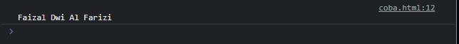
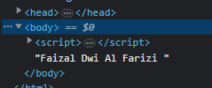

# Text Node

---

## Text Node

- Saat kita membuat HTML, kadang kita membuat teks tanpa tag
- Saat halaman web tersebut direpresentasikan dalam DOM, text tanpa tag bukanlah merupakan Element, melainkan Node
- Lebih tepatnya adalah Text Node
- https://developer.mozilla.org/en-US/docs/Web/API/Text

---

## Kode: Text Node

```html
<body>
Faizal Dwi Al Farizi
<script>
    const text = document.body.firstChild;
    console.log(text.wholeText);
</script>
</body>
```

**Hasil :**



---

## Membuat Text Node

- Kita juga bisa membuat Text Node menggunakan method document.createTextNode(string)
- Hasilnya berupa Text yang bisa kita tambahkan ke Node lain

---

## Kode: Membuat Text Node

```html
<body>
<script>
    const text = document.createTextNode("Faizal Dwi Al Farizi");
    document.body.appendChild(text);
</script>
</body>
```

**Hasil :**

