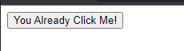

# Event Handler

---

## Event Handler

- Node memiliki kemampuan bereaksi terhadap suatu kejadian, misal kejadian di klik, mouse di atas node tersebut, dan lain-lain
- Ada banyak sekali jenis kejadian yang bisa kita buatkan aksinya ketika kejadian tersebut terjadi, atau dikenal dengan nama Event Handler
- Ada dua cara kita menambahkan Event Handler ke Node, menggunakan Event Target atau Global

---

## Event Handler

- https://developer.mozilla.org/en-US/docs/Web/API/EventTarget
- https://developer.mozilla.org/en-US/docs/Web/API/GlobalEventHandlers

---

## Event Target

- Event Target merupakan parent class dari Node, artinya semua Node memiliki kemampuan dari Event Target
- Pada Event Target, kita bisa menggunakan method addEventListener(type, callback) untuk menambahkan Event Handler
- https://developer.mozilla.org/en-US/docs/Web/API/EventTarget

---

## Kode : Event Listener

```html
<input type="button" id="clickMe" value="Click Me" />
<script>
    const clickMe = document.getElementById("clickMe");
    clickMe.addEventListener("click", function() {
        clickMe.setAttribute("value", "You Already Click Me!");
    });
</script>
```

**Hasil :**



---

## Global Event Handler

- Selain menggunakan Event Target, untuk menambahkan Event Handler, kita juga bisa menggunakan Global Event Handler
- Global Event Handler bukanlah sebuah super class, hanya kontrak yang bisa kita gunakan untuk menambah event handler sesuai dengan type event nya
- https://developer.mozilla.org/en-US/docs/Web/API/GlobalEventHandlers

---

## Kode : Global Event Handler

```html
<input type="button" id="clickMe" value="Click Me" />
<script>
    const clickMe = document.getElementById("clickMe");
    clickMe.onclick = function() {
        clickMe.setAttribute("value", "You Already Click Me!");
    }
</script>
```

**Hasil :**

