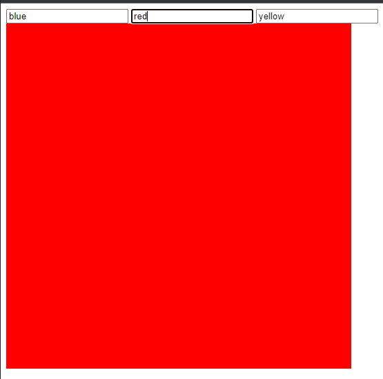

# Style

---

## Style

- DOM juga bisa digunakan untuk memanipulasi attribute style pada element dengan lebih mudah
- Kita tidak perlu menggunakan setAttribute(“style”, “value”) setiap ingin mengubah style sebuah element
- Kita bisa langsung gunakan element.style.name = value
- https://developer.mozilla.org/en-US/docs/Web/API/HTMLElement/style

---

## Nama Style

- Saat kita mengubah sebuah style, penamaan style menjadi berubah
- Pada style css, rata-rata menggunakan format lowercase dan -, misal background-color
- Sedangkan pada DOM Style, menggunakan format pascalCase, misal backgroundColor

---

## Kode : Style

```html
<input type="text" value="blue" />
<input type="text" value="red" />
<input type="text" value="yellow" />
<div id="canvas" style="width: 500px; height: 500px; background-color: black;"></div>
<script>
    const canvas = document.getElementById("canvas");
    const buttons = document.querySelectorAll("input");
    for(const button of buttons) {
        button.onclick = function() {
            canvas.style.backgroundColor = button.getAttribute("value");
        }
    }
</script>
```

**Hasil :**

