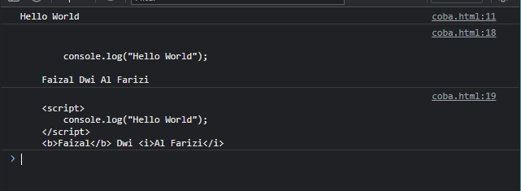
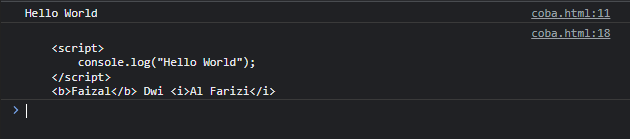

# InnerText dan InnerHTML

---

## Text Content dan Inner Text

- Selain textContent, terdapat property lain bernama innerText untuk mendapatkan isi text sebuah element
- Tujuan nya sama, untuk mengambil atau mengubah isi text konten sebuah element, namun ada perbedaannya
- textContent akan mengembalikan semua isi dari konten text sebuah element
- innerText bisa tahu, bagian text mana yang ditampilkan, dan dia hanya akan mengambil text yang ditampilkan saja

---

## Kode : Text Content dan Inner Text

```html
<p id="content">
    <script>
        console.log("Hello World");
    </script>
    <b>Faizal</b> Dwi <i>Al Farizi</i>
</p>

<script>
    const content = document.getElementById("content");
    console.log(content.textContent);
    console.log(content.innerHTML);
</script>
```

**Hasil :**



---

## Inner HTML

- Jika Text Content dan Inner Text hanya mengambil text saja, Inner HTML akan mengambil seluruh element HTML nya sebagai text
- Ini juga cocok jika kita ingin mengubah isi dari element menggunakan text yang berisi tag HTML

---

## Kode : Inner HTML

```html
<p id="content">
    <script>
        console.log("Hello World");
    </script>
    <b>Faizal</b> Dwi <i>Al Farizi</i>
</p>

<script>
    const content = document.getElementById("content");
    console.log(content.innerHTML);
</script>
```

**Hasil :**



---

## Mengubah Element dengan Inner HTML

- Salah satu kemampuan dari innerHTML adalah, kita bisa mengubah isi dari children sebuah element hanya dengan string
- Tag yang terdapat di dalam String secara otomatis akan menjadi child element

---

## Kode : Mengubah Element dengan Inner HTML

```html
<p id="content">
    <script>
        console.log("Hello World");
    </script>
    <b>Faizal</b> Dwi <i>Al Farizi</i>
</p>

<script>
    const content = document.getElementById("content");
    content.innerHTML = "<h1>This is Title</h1><p>This is Description</p>";
</script>
```

**Hasil :**

