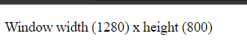

# Window

---

## Window

- Window merupakan representasi window yang berisikan DOM Document
- Beberapa JavaScript function sebenarnya berasal dari object Window, seperti alert(), confirm() dan prompt()
- Ada banyak sekali property, method dan event yang bisa kita gunakan pada window
- Untuk menggunakan Window, kita tidak perlu membuat objectnya, cukup gunakan kata kunci window
- https://developer.mozilla.org/en-US/docs/Web/API/Window

---

## Kode: Window

```html
<p id="content"></p>
<script>
    const content = document.getElementById("content");
    const height = window.screen.height;
    const width = window.screen.width;

    content.textContent = `Window width (${width}) x height (${height})`;
</script>
```

**Hasil :**

