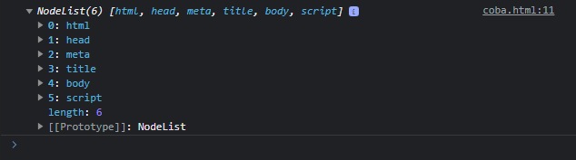
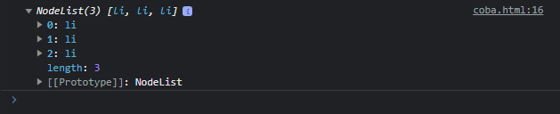
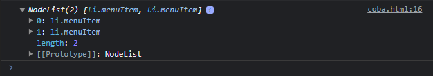
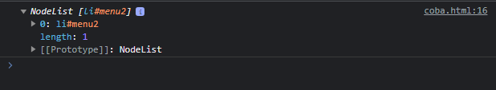
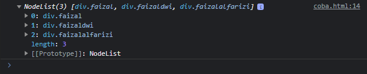

# Query Selector

---

## Query Selector

- Sebelumnya kita sudah menggunakan method querySelectorAll() pada Document, sekarang kita akan bahas lebih lengkap tentang Query Selector
- Query Selector merupakan method untuk menseleksi node sesuai dengan pola yang kita ingin cari
- Terdapat dua method untuk Query Selector :
  - Document.querySelector(pola) digunakan menyeleksi node pertama yang sesuai dengan pola
  - Document.querySelectorAll(pola) digunakan untuk menyeleksi semua node yang sesuai dengan pola

---

## Pola Query Selector

- Pola untuk Query Selector adalah menggunakan CSS Selector
- Penggunakan Pola nya mirip ketika kita membuat Selector di CSS
- Jika belum tahu tentang CSS Selector, disarankan untuk dipelajari ulang tentang materi CSS
- https://developer.mozilla.org/en-US/docs/Web/CSS/CSS_Selectors

---

## Universal Selector

- Universal Selector merupakan selector untuk menyeleksi semua element
- Kita bisa menggunakan karakter *
- https://developer.mozilla.org/en-US/docs/Web/CSS/Universal_selectors

---

## Kode : Universal Selector

```html
<body>
<script>
    const elements = document.querySelectorAll("*");
    console.log(elements);
</script>
</body>
```

**Hasil :**



---

## Type Selector

- Type Selector adalah selector yang digunakan untuk menyeleksi tag type HTML yang kita pilih
- Untuk menggunakannya, kita bisa langsung sebutkan nama tag nya
- https://developer.mozilla.org/en-US/docs/Web/CSS/Type_selectors

---

## Kode : Type Selector

```html
<ul>
    <li>1</li>
    <li>2</li>
    <li>3</li>
</ul>
<script>
    const elements = document.querySelectorAll("li");
    console.log(elements);
</script>
```

**Hasil :**



---

## Class Selector

- Class Selector merupakan selector untuk menyeleksi semua element yang memiliki class yang sesuai selector
- Untuk menggunakannya, kita bisa sebutkan nama class nya diawali dengan titik
- https://developer.mozilla.org/en-US/docs/Web/CSS/Class_selectors

---

## Kode : Class Selector

```html
<ul>
    <li class="menuItem">1</li>
    <li>2</li>
    <li class="menuItem">3</li>
</ul>
<script>
    const elements = document.querySelectorAll(".menuItem");
    console.log(elements);
</script>
```

**Hasil :**



---

## ID Selector

- ID Selector merupakan selector yang digunakan untuk menyeleksi id yang sesuai selector
- Untuk menggunakannya, kita bisa gunakan nama id diawali dengan karakter #
- https://developer.mozilla.org/en-US/docs/Web/CSS/ID_selectors

---

## Kode : ID Selector

```html
<ul>
    <li class="menuItem">1</li>
    <li id="menu2">2</li>
    <li class="menuItem">3</li>
</ul>
<script>
    const elements = document.querySelectorAll("#menu2");
    console.log(elements);
</script>
```

**Hasil :**



---

## Attribute Selector

- Attribute Selector merupakan selector yang bisa digunakan untuk menyeleksi element berdasarkan attribute nya
- Kita bisa menggunakan selector **`[attribute]`**
- Atau bisa juga untuk tag tertentu, misal menggunakan selector **`div[attribute]`**
- https://developer.mozilla.org/en-US/docs/Web/CSS/Attribute_selectors

---

## Kode: Attribute Selector

```html
<div class="faizal"></div>
<div class="dwi"></div>
<div class="alfarizi"></div>
<script>
    const elements = document.querySelectorAll("[class]");
    console.log(elements);
</script>
```

**Hasil :**


---

## Operator di Attribute Selector

- Kita juga bisa menggunakan operator pada attribut selector
- Misal **`[attribute=value]`**, **`[attribute^=value]`** dan lain-lain
- https://developer.mozilla.org/en-US/docs/Web/CSS/Attribute_selectors#syntax

---

## Kode : Operator Attribute Selector

```html
<div class="faizal"></div>
<div class="faizaldwi"></div>
<div class="faizalalfarizi"></div>
<script>
    const elements = document.querySelectorAll("div[class^='faizal'");
    console.log(elements);
</script>
```

**Hasil :**



---

## Dan Selector Lainnya

- https://developer.mozilla.org/en-US/docs/Web/CSS/CSS_Selectors