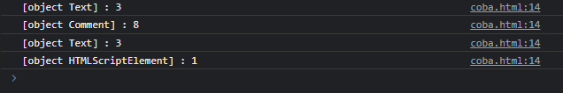

# Node Type

---

## Node Type

- Saat kita menyeleksi Node menjadi NodeList, kadang kita ingin tahu tipe Node tersebut
- Apakah Element, TextElement atau yang lainnya
- Node sendiri memiliki property bernama nodeType, dimana kita bisa melihat tipe dari node tersebut
- https://developer.mozilla.org/en-US/docs/Web/API/Node/nodeType

---

<table border="1" width="100%">
    <tr>
        <th>Constant</th>
        <th>Value</th>
        <th>Description</th>
    </tr>
    <tr>
        <td>Node.ELEMENT_NODE</td>
        <td>1</td>
        <td>An Element node like &lt;p&gt; or &lt;div&gt;</td>
    </tr>
    <tr>
        <td>Node.ATTRIBUTE_NODE</td>
        <td>2</td>
        <td>An Attribute of an Element</td>
    </tr>
    <tr>
        <td>Node.TEXT_NODE</td>
        <td>3</td>
        <td>The actual Text inside an Element or Attr</td>
    </tr>
    <tr>
        <td>Node.CDATA_SECTION_NODE</td>
        <td>4</td>
        <td>A CDATASection, such as &lt;!CDATA[[...]&gt;.</td>
    </tr>
    <tr>
        <td>Node.PROCESSING_INSTRUCTION_NODE</td>
        <td>7</td>
        <td>A ProcessingInstuction o an XML document, such as &lt;?xml-stylesheet...?&gt;</td>
    </tr>
    <tr>
        <td>Node.COMMENT_NODE</td>
        <td>8</td>
        <td>A Comment node, such as &lt;!-- ... --&gt;.</td>
    </tr>
    <tr>
        <td>Node.DOCUMENT_NODE</td>
        <td>9</td>
        <td>A Document node.</td>
    </tr>
    <tr>
        <td>Node.DOCUMENT_TYPE_NODE</td>
        <td>10</td>
        <td>A DocumentType node, such as &lt;!DOCTYPE html&gt;.</td>
    </tr>
    <tr>
        <td>Node.DOCUMENT_FRAGMENT_NODE</td>
        <td>11</td>
        <td>A DocumentFragment node.</td>
    </tr>
</table>

---

## Kode : Node Type

```html
<body>
Faizal Dwi Al Farizi
<!-- Hello World -->
<script>
    const nodes = document.body.childNodes;
    nodes.forEach(node => {
        console.log(`${node} : ${node.nodeType}`);
    })
</script>
</body>
```

**Hasil :**

