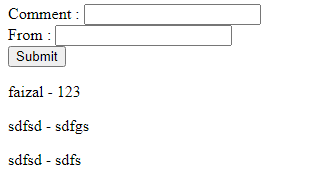

# HTML Form Element

---

## HTML Form Element

- Form adalah salah satu element yang memiliki banyak sekali fitur diluar dari Element DOM
- Hal ini karena penggunaan Form memang lebih kompleks dibandingkan element HTML lainnya
- Ada banyak sekali property, method dan juga event yang terdapat pada HTML form element atau input element
- https://developer.mozilla.org/en-US/docs/Web/API/HTMLFormElement
- https://developer.mozilla.org/en-US/docs/Web/API/HTMLInputElement

---

## Kode : HTML Form Element

```html
<form name="commentForm">
    <label for="comment">
        Comment : <input type="text" id="comment" name="comment" />
    </label>
    <br />
    <label for="from">
        From : <input type="text" id="from" name="from" />
    </label>
    <br />
    <input type="submit" value="Submit" />
</form>
<div id="commentList"></div>

<script>
    document.querySelector("form[name=commentForm]").onsubmit = function(event) {
        const commentList = document.getElementById("commentList");
        const comment = document.getElementById("comment").value;
        const from = document.getElementById("from").value;

        const commentItem = document.createElement("p");
        commentItem.textContent = `${comment} - ${from}`;
        commentList.appendChild(commentItem);

        document.forms['commentForm'].reset();

        event.preventDefault();
    }
</script>
```

**Hasil :**



---

## Akses Form Via Name

- Salah satu kelebihan Form adalah, kita bisa mengakses form hanya dengan menggunakan form name
- Kita bisa gunakan **`document.forms[name]`**
- Atau jika kita ingin mengakses input nya, kita juga bisa menggunakan name nya **`document.forms[name][inputName]`**

---

## Kode : HTML Form Element JavaScript

```html
<form name="commentForm">
    <label for="comment">
        Comment : <input type="text" id="comment" name="comment" />
    </label>
    <br />
    <label for="from">
        From : <input type="text" id="from" name="from" />
    </label>
    <br />
    <input type="submit" value="Submit" />
</form>
<div id="commentList"></div>

<script>
    document.querySelector("form[name=commentForm]").onsubmit = function(event) {
        const commentList = document.getElementById("commentList");
        const comment = document.forms['commentForm']['comment'].value;
        const from = document.forms['commentForm']['from'].value;

        const commentItem = document.createElement("p");
        commentItem.textContent = `${comment} - ${from}`;
        commentList.appendChild(commentItem);

        document.forms['commentForm'].reset();

        event.preventDefault();
    }
</script>
```