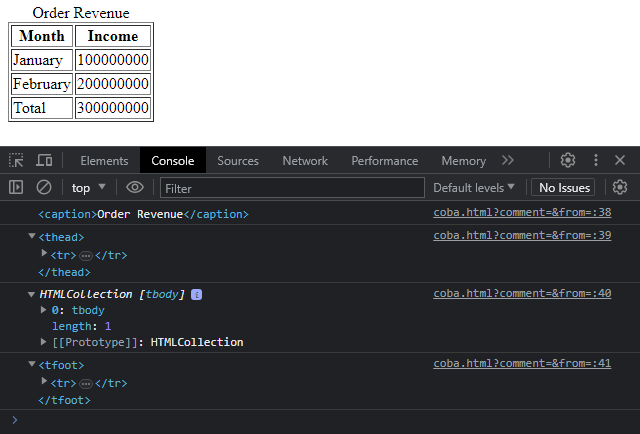

# HTML Table Element

---

## HTML Table Element

- Salah satu HTML Element yang kompleks selain Form adalah Table
- HTML Table Element juga memiliki banyak sekali property, method dan event yang khusus
- https://developer.mozilla.org/en-US/docs/Web/API/HTMLTableElement

---

## Kode : HTML Table Element

```html
<table id="orderRevenue" border="1">
    <caption>Order Revenue</caption>
    <thead>
        <tr>
            <th>Month</th>
            <th>Income</th>
        </tr>
    </thead>
    <tbody>
        <tr>
            <td>January</td>
            <td>100000000</td>
        </tr>
        <tr>
            <td>February</td>
            <td>200000000</td>
        </tr>
    </tbody>
    <tfoot>
        <tr>
            <td>Total</td>
            <td>300000000</td>
        </tr>
    </tfoot>
</table>
<div id="commentList"></div>

<script>
    const orderRevenue = document.getElementById("orderRevenue");
    console.log(orderRevenue.caption);
    console.log(orderRevenue.tHead);
    console.log(orderRevenue.tBodies);
    console.log(orderRevenue.tFoot);
</script>
```

**Hasil :**

