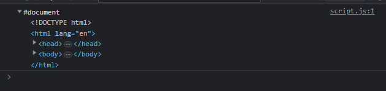
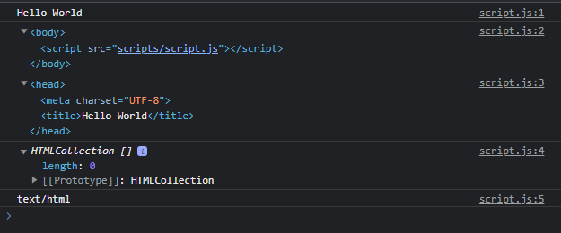
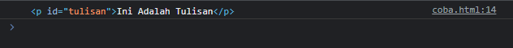

# Document

---

## Document

- Document merupakan representasi object dari halaman web
- Dalam satu halaman web, terdapat satu document, dan kita tidak perlu membuatnya secara manual, karena otomatis akan ada di browser
- Untuk mengakses Document, kita bisa gunakan object document
- https://developer.mozilla.org/en-US/docs/Web/API/Document

---

## document Object

- Document secara otomatis dibuat dalam browser ketika membuka halaman web, sehingga kita tidak perlu membuat objek Document secara manual
- Kita bisa langsung menggunakan kata kunci document

---

## Kode : Document

```js
console.log(document);
```

**Hasil :**



---

## Document Property

- Document memiliki banyak sekali property
- Property dalam Document bisa kita gunakan untuk melihat semua data yang terdapat dalam document halaman web
- https://developer.mozilla.org/en-US/docs/Web/API/Document#properties

---

## Kode : Document Property

```js
console.log(document.title);
console.log(document.body);
console.log(document.head);
console.log(document.images);
console.log(document.contentType);
```

**Hasil :**



---

## Document Method

- Document memiliki banyak sekali method
- Banyak method yang terdapat di document digunakan untuk memanipulasi data DOM, misal membuat Node, Element, Attribute atau mengambil dan menyeleksi Node di dalam document
- https://developer.mozilla.org/en-US/docs/Web/API/Document#methods

---

## Kode : Document Method

```html
<div>
    <p id="tulisan">Ini Adalah Tulisan</p>
</div>
<script>
    const tulisan = document.getElementById("tulisan");
    console.log(tulisan);
</script>
```

**Hasil :**

