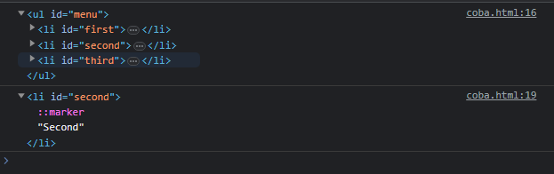
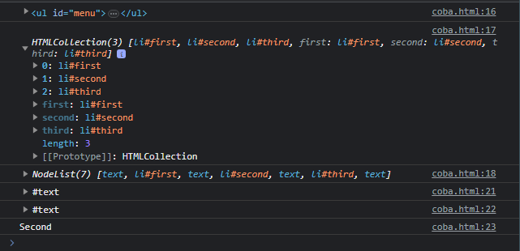
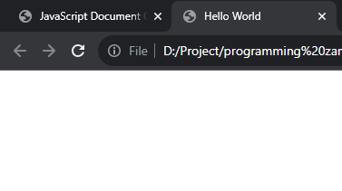

# Node

---

## Node

- Node adalah base class dari Document, Element dan Attr
- Artinya semua fitur yang dimiliki di Node dimiliki diturunannya
- Node dalam DOM itu bentuknya adalah Tree (pohon), artinya dengan Node, kita bisa melihat Parent (node diatas nya), Children (node dibawahnya), Sibling (node disebelahnya)
- https://developer.mozilla.org/en-US/docs/Web/API/Node

---

## Kode : Node

```html
<ul id="menu">
    <li id="first">first</li>
    <li id="second">Second</li>
    <li id="third">Third</li>
</ul>
<script>
    const menu = document.getElementById("menu");
    console.log(menu);

    const second = document.getElementById("second");
    console.log(second);
</script>
```

**Hasil :**



---

## Node Property

- Node memiliki banyak sekali property
- Property di Node banyak berisi informasi reference ke Node lain nya, seperti ke node parent nya, node children nya atau node sebelahnya
- https://developer.mozilla.org/en-US/docs/Web/API/Node#properties

---

## Kode : Node

```html
<ul id="menu">
    <li id="first">first</li>
    <li id="second">Second</li>
    <li id="third">Third</li>
</ul>
<script>
    const menu = document.getElementById("menu");
    console.log(menu);
    console.log(menu.children);
    console.log(menu.childNodes);

    const second = document.getElementById("second");
    console.log(second.previousSibling);
    console.log(second.nextSibling);
    console.log(second.textContent);
</script>
```
**Hasil :**



> untuk nextSibling & previousSibling enter dan spasi dihitung
---

## Node Method

- Node memiliki banyak sekali method
- Method di Node bisa digunakan untuk memanipulasi data Node di dalam Node tersebut, misal menambah/menghapus Node children
- https://developer.mozilla.org/en-US/docs/Web/API/Node#properties

---

## Kode : Node Method

```html
<ul id="menu">
    <li id="first">first</li>
    <li id="second">Second</li>
    <li id="third">Third</li>
</ul>
<script>
    const menu = document.getElementById("menu");
    menu.removeChild(document.getElementById("first"))
    menu.removeChild(document.getElementById("second"))
    menu.removeChild(document.getElementById("third"))
</script>
```

**Hasil :**

