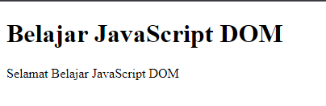
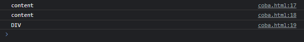
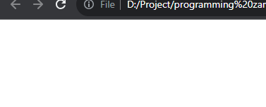
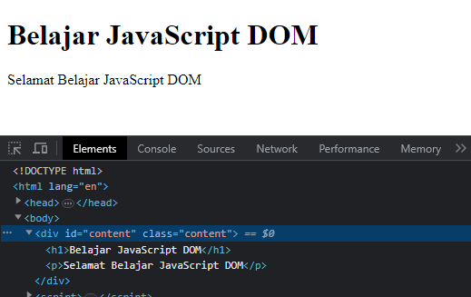

# Element

---

## Element

- Element merupakan Node yang berbentuk element, biasanya adalah element HTML, misal **`<html>`**, **`<head>`**, **`<body>`**, **`<div>`**, **`<table>`**, dan lain-lain
- https://developer.mozilla.org/en-US/docs/Web/API/Element

---

## Kode : Element

```html
<h1 id="title"></h1>
<p id="description"></p>
<script>
    const title = document.getElementById("title");
    title.textContent = "Belajar JavaScript DOM";

    const description = document.getElementById("description");
    description.textContent = "Selamat Belajar JavaScript DOM";
</script>
```

**Hasil :**



---

## Element Property

- Element memiliki banyak sekali property
- Dan karena Element adalah turunan dari Node, semua property Node pun bisa digunakan di Element
- https://developer.mozilla.org/en-US/docs/Web/API/Element#properties

---

## Kode : Element Property

```html
<div id="content" class="content">
    <h1 id="title" class="title">This is title</h1>
    <p id="description" class="description">This is Description</p>
</div>

<script>
    const content = document.getElementById("content");

    console.log(content.id);
    console.log(content.className);
    console.log(content.tagName);
</script>
```

**Hasil :**



---

## Element Method

- Element memiliki banyak sekali method
- Dan karena Element adalah turunan dari Node, semua method Node pun bisa digunakan di Element
- https://developer.mozilla.org/en-US/docs/Web/API/Element#methods

---

## Kode : Element Method

```html
<div id="content" class="content">
    <h1 id="title" class="title">This is title</h1>
    <p id="description" class="description">This is Description</p>
</div>

<script>
    const description = document.getElementById("description");
    const title = document.getElementById("title");

    description.remove();
    title.remove();
</script>
```

**Hasil :**



---

## Membuat Element

- Sebelumnya kita hanya mengambil element menggunakan id, artinya kita perlu buat dulu element nya di HTML
- Kita juga bisa membuat object element baru, dan menambahkannya ke halaman web
- Kita bisa menggunakan method createElement(tag) pada Document
- https://developer.mozilla.org/en-US/docs/Web/API/Document/createElement

---

## Kode : Membuat Element

```html
<div id="content" class="content"></div>

<script>
    const content = document.getElementById("content");

    const title = document.createElement("h1");
    title.textContent = "Belajar JavaScript DOM";
    content.appendChild(title);

    const description = document.createElement("p");
    description.textContent = "Selamat Belajar JavaScript DOM";
    content.appendChild(description);
</script>
```

**Hasil :**

