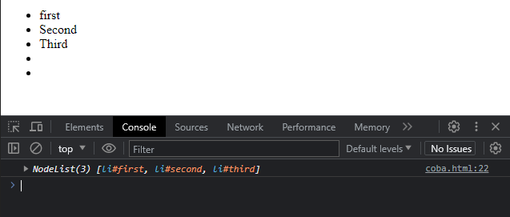

# NodeList

---

## NodeList

- NodeList adalah kumpulan dari Node
- Biasanya NodeList digunakan ketika kita menyeleksi banyak Node sekaligus, misal ketika kita ingin mengambil semua children di Node misalnya
- https://developer.mozilla.org/en-US/docs/Web/API/NodeList

---

## Kode : NodeList

```js
<ul id="menu1">
    <li id="first">first</li>
    <li id="second">Second</li>
    <li id="third">Third</li>
</ul>

<script>
    const list = document.querySelectorAll("li");
    console.log(list);

    const list1 = document.getElementById("menu1").childNodes;
    console.log(list1);

    const list2 = document.getElementById("menu1").childNodes;
    console.log(list2);
</script>
```

**Hasil :**


---

## Live vs Static NodeList

- NodeList memiliki 2 tipe, yaitu Live dan Static
- Live artinya perubahan yang terjadi pada NodeList nya, akan merubah semua NodeList yang sama
- Static artinya perubahan yang terjadi pada NodeList nya, tidak akan merubah semua NodeList yang sama
- Saat kita menggunakan element.childNodes, NodeList tersebut bersifat Live
- Saat kita menggunakan document.querySelectorAll(), NodeList tersebut bersifat Static

---

## Kode : NodeList Live

```html
<ul id="menu1">
    <li id="first">first</li>
    <li id="second">Second</li>
    <li id="third">Third</li>
</ul>

<script>
    const menu1 = document.getElementById("menu1");
    const list1 = menu1.childNodes;

    menu1.append(document.createElement("li"));
    menu1.append(document.createElement("li"));

    console.log(list1);
</script>
```

**Hasil :**


---

## Kode : NodeList Static

```html
<ul id="menu1">
    <li id="first">first</li>
    <li id="second">Second</li>
    <li id="third">Third</li>
</ul>

<script>
    const list = document.querySelectorAll("li");

    const menu1 = document.getElementById("menu1");
    menu1.append(document.createElement("li"));
    menu1.append(document.createElement("li"));

    console.log(list);
</script>
```

**Hasil :**

