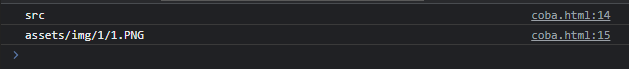
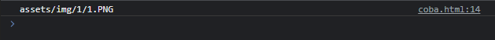

# Attr

---

## Attr

- Attr atau attribute merupakan representasi dari attribute sebuah element, atau singkatnya key-value, key nya adalah nama attribute, dan value nya adalah value attribute
- https://developer.mozilla.org/en-US/docs/Web/API/Attr

---

## Kode: Attr

```html

<script>
    const logo = document.getElementById("logo");
    const src = logo.getAttributeNode("src");

    console.log(src.name);
    console.log(src.value);
</script>
```

**Hasil :**



---

## Attr Value

- Kadang kebanyakan programmer ingin langsung mendapatkan value Attr
- Jarang sekali menggunakan object Attr nya
- Untuk mendapatkan value secara langsung, kita bisa menggunakan method getAttribute(name) di Element

---

## Kode : Attr Value

```html

<script>
    const logo = document.getElementById("logo");
    const src = logo.getAttribute("src");

    console.log(src);
</script>
```

**Hasil :**



---

## Membuat Attr

- Untuk membuat Attr, kita bisa menggunakan document.createAttribute(name)
- Lalu untuk menambahkannya ke Element, kita bisa gunakan element.setAttributeNode(attr)
- Atau kita juga bisa langsung membuat Attr langsung dengan name dan value nya menggunakan element.setAttribute(name, value)

---

## Kode: Membuat Attr