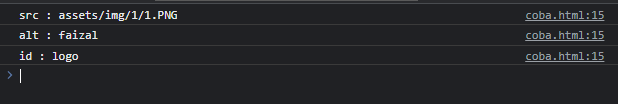

# NamedNodeMap

---

## NamedNodeMap

- NamedNodeMap merupakan kumpulan dari Attr
- Mirip seperti NodeList, namun isinya adalah Attr
- https://developer.mozilla.org/en-US/docs/Web/API/NamedNodeMap

---

## Kode: NamedNodeMap

```html

<script>
    const logo = document.getElementById("logo");
    const attributes = logo.attributes;

    for(let attribute of attributes) {
        console.log(`${attribute.name} : ${attribute.value}`);
    }
</script>
```

**Hasil :**

