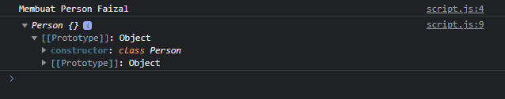

# Constructor di Class

---

## Constructor di Class

- Karena bentuk constructor function mirip dengan function, jadi kita bisa menambah parameter pada constructor function, lantas bagaimana dengan class?
- Di class juga kita bisa menambah constructor, dimana dengan menggunakan constructor, kita juga bisa menambah parameter saat pertama kali membuat object nya
- Untuk membuat constructor di class, kita bisa menggunakan kata kunci constructor

---

## Kode : Constructor di Class

```js
class Person {
    constructor(name) {
        // kode apapun
        console.log(`Membuat Person ${name}`);
    }
}

const faizal = new Person("Faizal");
console.log(faizal);
```

**Hasil :**

