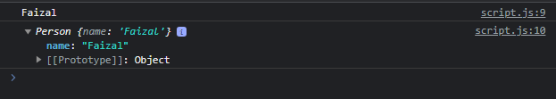

# Property di Class

---

## Property di Class


- Sama seperti pada constructor function, dalam class pun kita bisa menambahkan property
- Karena hasil akhirnya adalah sebuah object, jadi menambahkan property di class bisa juga dilakukan di instance object nya

---

## Kode : Property di Class

```js
class Person {
    constructor(name) {
        // kode apapun
        this.name = name
    }
}

const faizal = new Person("Faizal");
console.log(faizal.name);
console.log(faizal);
```

**Hasil :**

