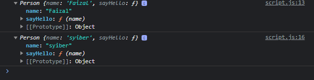
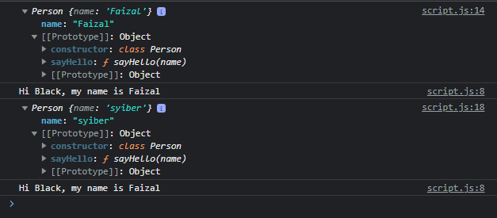

# Method di Class

---

## Method di Class

- Membuat method di class sebenarnya bisa dilakukan dengan cara seperti menambahkan method di constructor function
- Namun, hal tersebut sebenarnya menambahkan method ke dalam instance object
- Khusus untuk method sebaiknya kita menambahkan ke prototype, bukan ke instance object
- Untung nya di class, ada cara mudah menambahkan method dan secara otomatis ditambahkan ke prototype

---

## Kode : Method di Class

---

## Console : Method di Prototype

> tidak direkomendasikan

```js
class Person {
    constructor(name) {
        // kode apapun
        this.name = name
        this.sayHello = function (name) {
            console.log(`Hi ${name}, my name is ${this.name}`);
        }
    }

}

const faizal = new Person("Faizal");
console.log(faizal);

const syiber = new Person("syiber");
console.log(syiber);
```
**Hasil :**



> direkomendasikan

```js
class Person {
    constructor(name) {
        // kode apapun
        this.name = name
    }

    sayHello (name) {
        console.log(`Hi ${name}, my name is ${this.name}`);
    }

}

const faizal = new Person("Faizal");
console.log(faizal);
faizal.sayHello("Black");

const syiber = new Person("syiber");
console.log(syiber);
faizal.sayHello("Black");
```

**Hasil :**



> karena method tersebut nempel di prototype nya bukan di instence objectnya