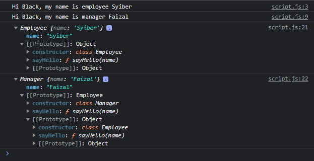

# Class Inheritance

---

## Class Inheritance

- Sebelumnya kita sudah tahu bahwa prototype mendukung pewarisan, walaupun agak sedikit tricky cara pembuatannya
- Untungnya itu diperbaiki di ES6 dengan fitur class nya
- Sebuah class bisa melakukan pewarisan dari class lainnya dengan menggunakan kata kunci extends
- Di JavaScript, class inheritance sama seperti prototype inheritance, hanya bisa memiliki satu parent class

---

## Kode : Class Inheritance

```js
class Employee {
    sayHello(name) {
        console.log(`Hi ${name}, my name is employee ${this.name}`);
    }
}

class Manager extends Employee {
    sayHello(name) {
        console.log(`Hi ${name}, my name is manager ${this.name}`);
    }
}

const syiber = new Employee();
syiber.name = "Syiber";
syiber.sayHello("Black");

const faizal = new Manager();
faizal.name = "Faizal";
faizal.sayHello("Black");

console.log(syiber);
console.log(faizal);
```

**Hasil :**

