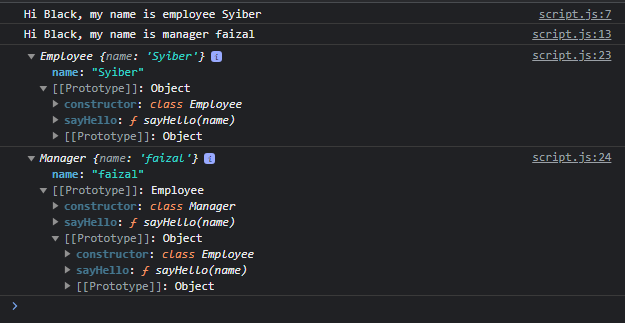
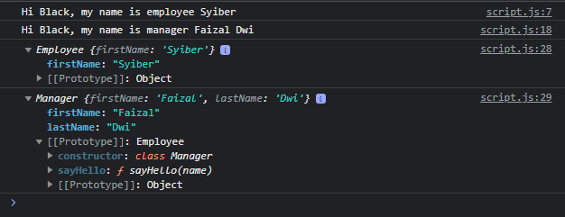

# Super Constructor

---

## Super Constructor

- Class Inheritance sifatnya seperti Prototype Inheritance
- Bagaimana dengan Constructor Inheritance? Sebenarnya Constructor Inheritance hanyalah melakukan eksekusi constructor lain dengan tujuan agar property di constructor lain bisa ditambahkan ke instance object ini
- Dalam kasus ini, jika kita ingin mencapai hasil yang sama, kita bisa menggunakan kata kunci super di dalam constructor
- Kata kunci super digunakan untuk memanggil constructor super class
- Jika di child class kita membuat constructor, maka kita wajib memanggil parent constructor, walaupun di parent tidak ada constructor

---

## Kode : Super Constructor (1)

```js
class Employee {
    constructor(name) {
        this.name = name;
    }

    sayHello(name) {
        console.log(`Hi ${name}, my name is employee ${this.name}`);
    }
}

class Manager extends Employee {
    sayHello(name) {
        console.log(`Hi ${name}, my name is manager ${this.name}`);
    }
}

const syiber = new Employee("Syiber");
syiber.sayHello("Black");

const faizal = new Manager("faizal");
faizal.sayHello("Black");

console.log(syiber);
console.log(faizal);
```

**Hasil :**



---

## Kode : Super Constructor (2)

```js
class Employee {
    constructor(firstName) {
        this.firstName = firstName;
    }

    sayHello(name) {
        console.log(`Hi ${name}, my name is employee ${this.firstName}`);
    }
}

class Manager extends Employee {
    constructor(firstName, lastName) {
        super(firstName);
        this.lastName = lastName;
    }

    sayHello(name) {
        console.log(`Hi ${name}, my name is manager ${this.firstName} ${this.lastName}`);
    }
}

const syiber = new Employee("Syiber");
syiber.sayHello("Black");

const faizal = new Manager("Faizal", "Dwi");
faizal.sayHello("Black");

console.log(syiber);
console.log(faizal);
```

**Hasil :**

